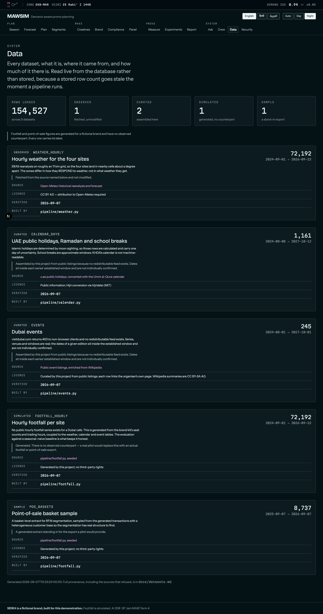
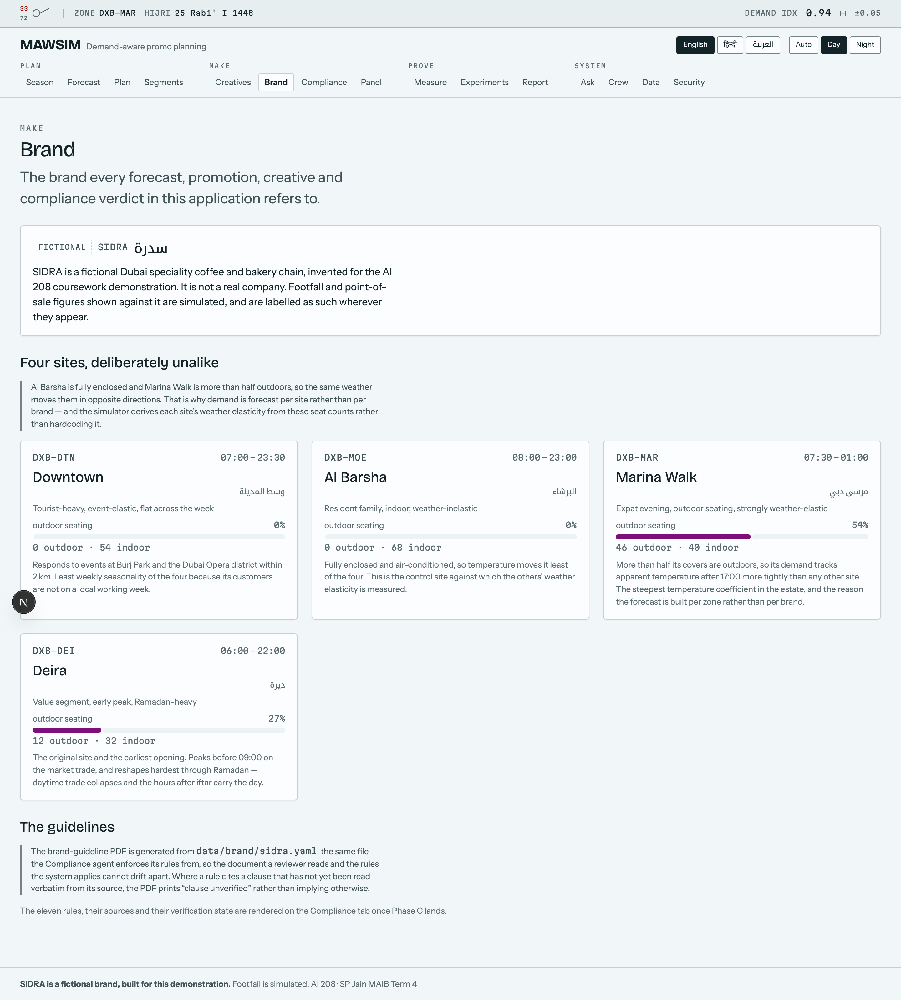
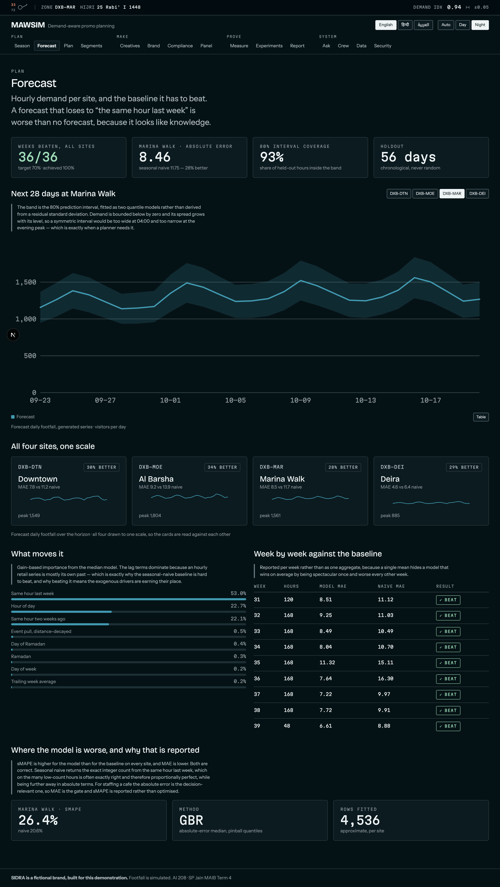
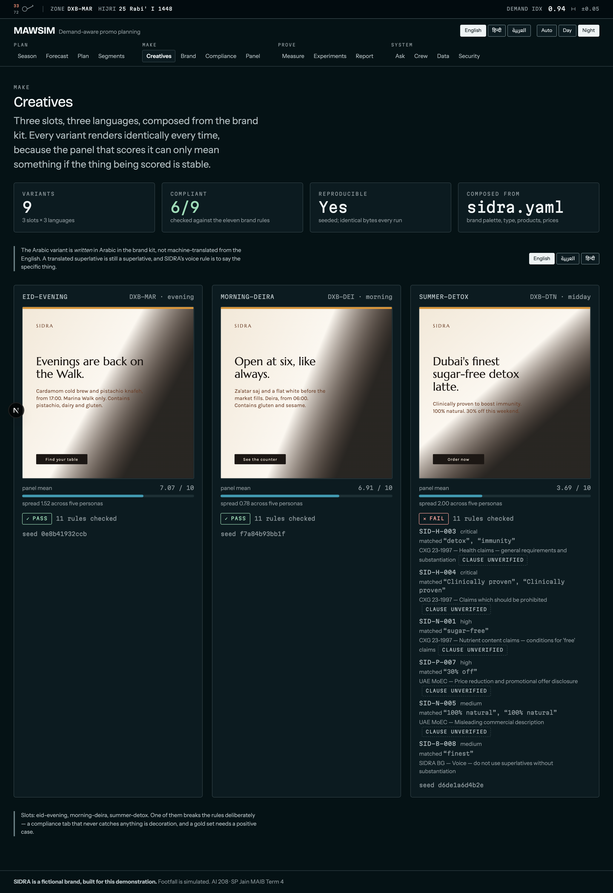

# UPLIFT — MAWSIM

**Demand-aware promo planning for Dubai retail.** Events, weather, holidays and
school calendars drive footfall. MAWSIM forecasts that demand per store zone,
lets a bounded agent crew plan promotions and creatives against the forecast,
checks every claim against brand and food-advertising rules with citations, and
then measures **incremental lift** rather than clicks.

Built for SP Jain MAIB Term 4, AI 208 AI in Marketing. Owner: Krishna Mathur.

> ### The brand is fictional
> **SIDRA** (سدرة) is an invented Dubai speciality coffee and bakery chain with
> four locations. It is not a real company, and nothing here is a claim about any
> real business. The footfall and point-of-sale figures it is planned against are
> **generated** by a seeded model in `pipeline/footfall.py`. `FootfallRecord`
> cannot be constructed without `simulated=True`, the database column is
> `NOT NULL CHECK (simulated = 1)`, and every API response and every chart says
> so. A real pilot replaces that dataset with an actual export; nothing else in
> the system changes.


**The chart on the lower right is the argument.** Four sites, one axis, evening
footfall against apparent temperature. Marina Walk — 54% of its seats outdoors —
falls away as the evening heats up. Al Barsha, fully enclosed, barely moves. All
four sit in neighbouring ERA5 grid cells, so they get the *same* weather: what
differs is how they respond to it, and that is why demand is forecast per site
rather than per brand.

That elasticity is not written into the simulator. It is **derived** from the
seat counts in `data/brand/sidra.yaml`, so the measured result — Marina Walk
2.4× more temperature-sensitive than Al Barsha, with the ordering across all
four sites matching their outdoor share exactly — is emergent rather than
assumed. Change the seat counts and it follows.

<table>
<tr>
<td width="50%"></td>
<td width="50%"></td>
</tr>
<tr>
<td><b>Every dataset says what it is.</b> Observed, curated, simulated or
sample — a Dataset cannot be constructed without a licence, a source URL, a
named build script and one of those four labels. The constructor raises, and a
test asserts each refusal, so a dataset added later without provenance fails the
build rather than appearing on a chart with nothing attached to it.</td>
<td><b>The brand kit is the single source of truth.</b> The guideline PDF, the
Creative agent's palette and the Compliance agent's eleven rules all read
<code>data/brand/sidra.yaml</code>, so the document a reviewer checks and the
rules the system applies cannot drift apart.</td>
</tr>
</table>

> Captured from a local run against a built database. Regenerate with
> `cd apps/web && node scripts/screenshots.mjs`.

## Live

| | |
|---|---|
| **Application** | **https://uplift-mawsim.vercel.app** |
| **API** | **https://mawsim-api.onrender.com** — [`/docs`](https://mawsim-api.onrender.com/docs) · [`/healthz`](https://mawsim-api.onrender.com/healthz) |
| **Verify it** | `LIVE_API_URL=https://mawsim-api.onrender.com LIVE_WEB_URL=https://uplift-mawsim.vercel.app make smoke-live` |

All fifteen tabs serve measured data. The five live checks pass: the API
answers, no dataset is empty, the page carries the disclaimer, the web app
reaches the API across origins, and every tab is present.

**The API sleeps after fifteen minutes idle**, so the first request after a
quiet period takes about fifty seconds while the free instance wakes. For a
live demo, open [`/healthz`](https://mawsim-api.onrender.com/healthz) a minute
before you start. Every page renders an honest "API unreachable" state in the
meantime rather than an empty chart.

### What deployment taught the project

Three failures reached production and were caught by things built to catch them.

**The database went to `/tmp` and vanished.** Render's build and its runtime are
different containers. The four pipelines ran, wrote a complete database, and
threw it away. `/healthz` reported `degraded` and named all five empty datasets
on the first request — which is the entire reason it reports what is *loaded*
rather than only that the process is up.

**A global gitignore was hiding a required input.** `~/.gitignore_global`
excludes `data/raw/` for every repository on the machine, so the curated events
seed was never committed. `git status` was clean, the file was on disk, and
nothing inside the repository revealed it. `tests/invariants/test_repo_is_complete.py`
now asserts that every input the project needs to rebuild itself is tracked.

**The forecast endpoint fitted models per request** — ninety seconds on a
512 MB instance. The horizon is precomputed at build time and served as data;
the endpoint went to 21 ms.

## Standing constraints

- **Zero paid inference.** Ollama (local) → Gemini free tier → Groq free tier →
  a deterministic stub. Anthropic is present in the provider chain and
  permanently refuses to serve, so the refusal is visible in the code and covered
  by a test rather than being an absence someone later "fixes". Budgets are
  counted in **requests**, never tokens: the free tiers do not return
  trustworthy token accounting, and a number the project cannot verify has no
  business appearing in a report.
- **Only free, licensed data.** Every source is in
  [`docs/datasets.md`](docs/datasets.md) with its URL, the date it was verified
  **by fetching it**, and its licence. The sources that refused are recorded
  there as prominently as the ones that worked, because which sources refused is
  part of what shaped the design.
- **Every number traces to [`docs/results/`](docs/results).** Not as a promise —
  `tests/test_docs_match_results.py` extracts the figures quoted in
  `docs/models.md` and fails if they disagree with the JSON that produced them.
- **No agent has a side-effect tool.** Nothing is published or executed
  externally. Exporting a campaign is a human action, taken outside this
  application.

## Fifteen tabs, all working

Every tab renders measured output. None is a scaffold.

| Group | Tabs |
|---|---|
| **Plan** | Season (3D terrain + map) · Forecast · Plan · Segments |
| **Make** | Creatives · Brand · Compliance · Panel |
| **Prove** | Measure · Experiments · Report |
| **System** | Ask · Crew · Data · Security |

<table>
<tr>
<td width="50%"></td>
<td width="50%"></td>
</tr>
<tr>
<td><b>The forecast is gated on a baseline.</b> 36 of 36 site-weeks
beaten against a 70% target. The interval is two quantile models, not a
residual multiplied by 1.28 — demand is bounded below by zero and its spread grows with its
level.</td>
<td><b>Creatives are composed, not generated.</b> Free image endpoints garble Arabic inside
images, which in an application about brand compliance is a liability. Each is an SVG built from
the brand kit, identical every run — which is what makes a panel score mean anything. One breaks
the rules on purpose.</td>
</tr>
</table>

## What is measured, and where

| Claim | Evidence | Result |
|---|---|---|
| Forecast beats seasonal naive | `python scripts/run_phase_b.py` | **36/36 site-weeks**, MAE 28–34% lower — [`B1`](docs/results/B1-forecast.json) |
| An injected lift is recovered | same | all 5 checks within **2.61 pts** of a 5-point tolerance — [`B4`](docs/results/B4-uplift.json) |
| Segments survive resampling | same | **91.8%** keep their segment — [`B2`](docs/results/B2-segments.json) |
| The allocator finds the optimum | same | KKT marginal spread ~0 — [`B3`](docs/results/B3-allocator.json) |
| Compliance catches violations in three languages | `python scripts/run_phase_c.py` | recall **100%** worst language, precision 100% — [`C1`](docs/results/C1-compliance.json) |
| Weather history is complete | `python -m pipeline.weather --verify` | 18,048 hours per site, no gap over 3 h — [`A4`](docs/results/A4-weather-etl.json) |
| Islamic dates reproduce UAE observances | `python -m pipeline.calendar --verify` | all four 2025 observances matched — [`A5`](docs/results/A5-calendar.json) |
| Events are curated and say so | `python -m pipeline.events --verify` | 245 instances, no row claiming a verified date — [`A6`](docs/results/A6-events.json) |
| Sites respond differently to weather | `python -m pipeline.footfall --verify` | slope ordering matches outdoor-share ordering — [`A7`](docs/results/A7-footfall.json) |
| The embedding model is fit for trilingual retrieval | `python scripts/spike_embeddings.py` | bge-m3 +0.447/+0.318 margin; nomic-embed-text disqualified — [`A9`](docs/results/A9-embedding-spike.json) |
| Text and UI meet WCAG in both registers | `node apps/web/scripts/check-contrast.mjs` | 36 pairs measured — [`A2`](docs/results/A2-contrast.json) |
| Chart series and verdicts are distinguishable | `node apps/web/scripts/check-palette.mjs` | six checks per register plus the zone rule, deuteranopia included — [`A10`](docs/results/A10-palette.json) |
| The shell is responsive, accessible and RTL-correct | `make e2e` | **78 Playwright tests**, no serious axe violation on any tab in either register |
| No agent can reach the outside world | `pytest tests/invariants` | every route is a GET; the crew's side-effects column is `none` on every row |
| The safety claims survive being attacked | `python scripts/red_team.py` | 34 attacks, 7 controls, **33 held** — and the one that works is scored as a break — [`E1`](docs/results/E1-red-team.json) |
| Provider spend stays at zero | `pytest tests/core/test_llm.py` | Anthropic reports itself unavailable with a key set; the chain ends in a deterministic stub |
| Every artefact still matches its builder | `pytest tests/test_artefacts_are_current.py` | report, deck, viva, demo and notebook regenerate byte-identically from `docs/results/` |

## Running it

```bash
uv sync --extra dev
cd apps/web && npm install && cd ../..
make etl        # build the datasets — weather and events reach the network, cached to data/raw/
uv run python scripts/run_phase_b.py   # forecast, segments, allocator, uplift
uv run python scripts/run_phase_c.py   # compliance and panel
uv run python scripts/build_report.py  # the AI 208 artefact, from docs/results/
uv run python scripts/red_team.py      # 34 attacks against the safety claims
make check      # the green bar: ruff, pytest, contrast, palette, red team, placeholders, typecheck
make e2e        # Playwright; starts both servers itself
make api        # http://localhost:8000/docs
make web        # http://localhost:3000
```

## Layout

| Path | What lives there |
|---|---|
| `services/api/` | FastAPI service: dataset registry, series endpoints, brand kit loader |
| `pipeline/` | The four ETLs — weather, calendar, events, footfall — each with `--verify` |
| `apps/web/` | Next 16 application: fifteen tabs, three languages, two registers |
| `data/brand/sidra.yaml` | The single source of truth for the fictional brand |
| `docs/results/` | Every measured number, written by a script |
| `docs/datasets.md` · `docs/models.md` | What the data is, what the models are, and why |
| `docs/directions.md` | The three design directions that were built, and which one was chosen |
| `docs/artefacts/` | The AI 208 report (markdown + docx), deck outline, 15 viva answers, three-minute demo script, and a notebook that re-runs the numbers |
| `scripts/red_team.py` | The 34 attacks, run inside `make check` |

## Limitations

Stated here rather than discovered by a reader.

- **Footfall is generated.** No public hourly footfall series exists for any
  Dubai café. What is not invented is the evaluation: the forecaster is scored
  against a seasonal-naive baseline on held-out data, and a model that cannot
  beat "same hour last week" is not used.
- **Event dates are placed, not confirmed.** Visit Dubai returns 403 to every
  non-browser client and no redistributable feed exists. The series, venues and
  calendar windows are real; the dates of a given edition sit inside the
  established window and carry `date_confidence: annual_window`.
- **Islamic holidays are calculated.** u.ae states they are set by moon
  sighting, so every such row carries one day of uncertainty.
- **School breaks are approximate windows.** KHDA's calendar page redirects to a
  host whose certificate does not verify.
- **Most compliance clauses are unread.** The source documents are verified; the
  specific clauses are quoted verbatim during Phase C's corpus ingestion, and
  until then the generated brand PDF prints "clause unverified" rather than
  implying otherwise.
- **Weather is a coarse grid.** ERA5 at roughly 11 km, so the four sites do not
  each get their own station.
- **Allocator elasticities are assumed.** No promotion has run, so there is
  nothing to fit them to. Every response carries `assumed: true`.
- **Synthetic control cannot fully control for weather here.** With four sites
  and one uniquely weather-elastic, the treated unit is inside the donors' hull
  on level and outside it on elasticity. The residual bias is measured on a
  placebo-in-time window and reported rather than absorbed.
- **Roles are a request header, not an identity.** `X-Mawsim-Role` is
  unauthenticated, so anyone can send `admin`. The red-team harness scores that
  as a break rather than as an expected result, and the Security tab shows the
  row. It is adequate here only because the entire API is read-only: the worst a
  forged header achieves is stopping a demo.
- **The persona panel is not customer research.** It applies a rubric; it does
  not observe a reaction.
- **Ask retrieves, it does not generate.** BM25 over the project's own corpus,
  returning passages with sources. A model that writes prose over them is Phase C.

## Not advice

MAWSIM produces a marketing plan and a compliance opinion for a fictional brand
as coursework. It is not legal advice, not regulatory clearance, and not a
substitute for real customer research. Its persona panel simulates reactions; it
does not observe them.
